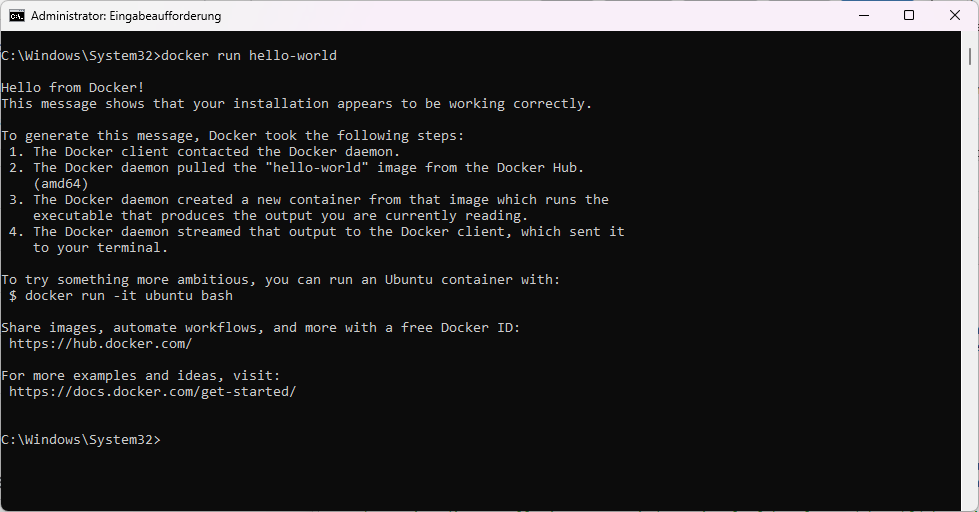

# Übungsanleitung: Installation von Docker

## Ziel
Docker auf Ihrem Computer installieren, um eine Umgebung für die Entwicklung und Ausführung von containerbasierten Anwendungen zu schaffen. 

---

### Schritt 1: Vorbereitung
- **Prüfen der Systemanforderungen:** 
  - Stellen Sie sicher, dass Ihr Betriebssystem die Docker-Installation unterstützt. Docker ist kompatibel mit den meisten modernen Windows-, macOS- und Linux-Versionen. Eine Liste der unterstützten Systeme finden Sie [hier](https://docs.docker.com/engine/install/).
  
- **Sicherstellen ausreichender Systemressourcen:** 
  - Docker benötigt mindestens 4 GB RAM und 20 GB freien Speicherplatz, um optimal zu funktionieren. Überprüfen Sie die Systemressourcen über die Systemeinstellungen oder mit dem Befehl `free -h` (Linux) bzw. `Systeminfo` (Windows).

### Schritt 2: Download von Docker
- **Besuchen Sie die Docker-Website:** 
  - Gehen Sie auf [Docker Hub](https://hub.docker.com/).
  
- **Wählen Sie die passende Version:** 
  - Laden Sie Docker Desktop für Windows oder Mac herunter. Linux-Benutzer sollten die spezifischen Pakete für ihre Distribution herunterladen. Für Ubuntu-Benutzer gibt es eine spezielle Anleitung, die [hier](https://docs.docker.com/engine/install/ubuntu/) zu finden ist.

### Schritt 3: Installation
- **Windows:**
  - Führen Sie die heruntergeladene Installationsdatei aus.
  - Folgen Sie den Anweisungen des Installationsassistenten.
  - Möglicherweise müssen Sie Ihren Computer neu starten, um die Installation abzuschließen.
  - Nach dem Neustart überprüfen Sie, ob das Docker-Symbol in der Taskleiste erscheint.

	ebenso ist die Installation unter Windows mittels [Chocolatey (Choco)](choco-install.md) möglich

- **macOS:**
  - Öffnen Sie die heruntergeladene `.dmg`-Datei.
  - Ziehen Sie das Docker-Symbol in den Anwendungsordner.
  - Starten Sie Docker aus dem Anwendungsordner.
  - Geben Sie Ihr Passwort ein, wenn Sie dazu aufgefordert werden, um die Installation abzuschließen.

- **Linux:**
  - Die Installation variiert je nach Distribution. In den meisten Fällen können Sie Docker über den Paketmanager installieren.
  - Beispiel für Ubuntu: Öffnen Sie ein Terminal und führen Sie die folgenden Befehle aus:
    ```bash
    sudo apt-get update
    sudo apt-get install docker-ce docker-ce-cli containerd.io
    ```
  - Starten Sie den Docker-Dienst mit:
    ```bash
    sudo systemctl start docker
    ```

### Schritt 4: Überprüfung der Installation
- **Überprüfen Sie die Installation:** 
  - Öffnen Sie ein Terminal oder eine Eingabeaufforderung und geben Sie `docker --version` ein. Dies sollte die installierte Docker-Version anzeigen.
  
- **Testlauf:** 
  - Führen Sie `docker run hello-world` aus. Docker sollte ein Test-Image herunterladen und eine Begrüßungsnachricht anzeigen. 
  - Wenn der Befehl nicht funktioniert, achten Sie darauf, dass die **Docker Engine** läuft. Ein Start des **Docker Desktop** sollte ausreichen.



### Schritt 5: Post-Installationsschritte (optional)
- **Konfigurieren der Docker-Einstellungen:** 
  - Sie können Docker so konfigurieren, dass es beim Systemstart automatisch startet. Dies kann in den Einstellungen von Docker Desktop aktiviert werden.

- **Nutzergruppen (Linux):** 
  - Fügen Sie Ihren Benutzer zur `docker`-Gruppe hinzu, um Docker-Befehle ohne `sudo` ausführen zu können. Verwenden Sie dazu:
    ```bash
    sudo usermod -aG docker IhrBenutzername
    ```
  - Loggen Sie sich aus und wieder ein, damit die Änderungen wirksam werden.

### Schritt 6: Erste Schritte
- **Erkunden Sie Docker:** 
  - Experimentieren Sie mit grundlegenden Docker-Befehlen wie:
    - `docker pull`: Lädt ein Image von Docker Hub herunter.
    - `docker run`: Führt ein Image als Container aus.
    - `docker images`: Listet alle lokal gespeicherten Images auf.
    - `docker ps`: Listet alle aktuell laufenden Container auf.

- **Erstellen Sie ein einfaches Docker-Image**: Erstellen Sie ein Dockerfile, um Ihre erste Anwendung zu containerisieren. Hier ist ein einfaches Beispiel für eine Node.js-App:
   ```dockerfile
   # Wählen Sie das Basis-Image aus
   FROM node:14

   # Setzen Sie das Arbeitsverzeichnis
   WORKDIR /app

   # Kopieren Sie package.json und installiere Abhängigkeiten
   COPY package.json ./
   RUN npm install

   # Kopieren Sie den restlichen Code
   COPY . .

   # Exponieren Sie den Port
   EXPOSE 3000

   # Definieren Sie den Befehl zum Ausführen der Anwendung
   CMD ["npm", "start"]
   ```

   - Speichern Sie dieses Dockerfile im Hauptverzeichnis Ihrer Node.js-App und führen Sie die Schritte zur Erstellung und Ausführung des Docker-Images durch.

---

Mit diesen Schritten sollten Sie Docker erfolgreich auf Ihrem System installiert haben und bereit sein, in die Welt der Containerisierung einzutauchen. Zögern Sie nicht, die offiziellen [Docker-Dokumentationen](https://docs.docker.com/get-started/) für weiterführende Informationen zu konsultieren.